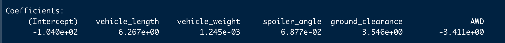
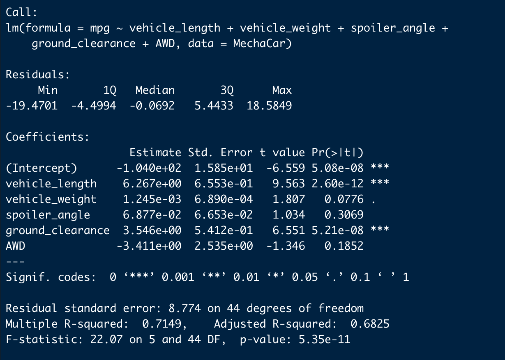
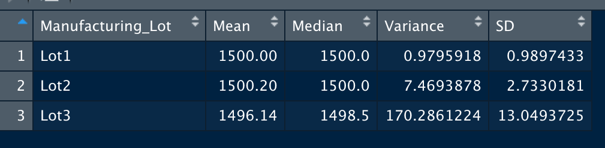
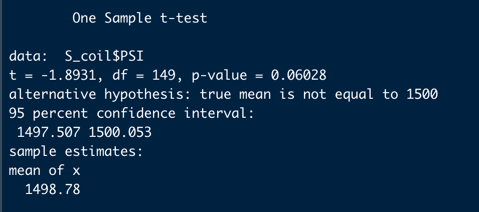
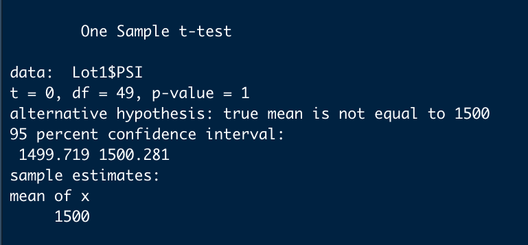
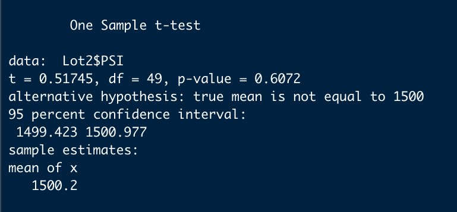
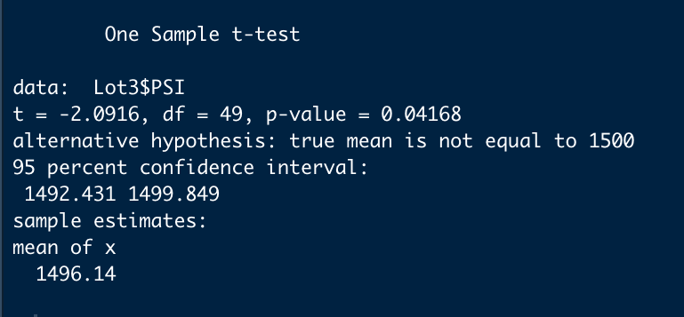

# MechaCar_Statistical_Analysis
UCB Challenge: Using statistics and hypothesis testing to statistics and hypothesis testing to analyze a series of datasets from the automotive industry; All statistical analysis and visualizations will be written in the R programming language.
 
# Linear Regression to Predict MPG

## Linear Regression

The linear regression model produced a Y-Intercept of -1.040e+02 and slope coefficients for each factor listed underneath that respective factor.

## Multiple Regression Summary

* The values in the last column of the summary, Pr((>|t|), represents the probability that each coefficient contributes a random amount of variance to the linear model. According to our results, vehicle length and ground clearance (including the intercept) are statistically unlikely to provide random amounts of variance to the linear model. In other words the vehicle length and ground clearance have a significant impact on the mechacar's fuel consumption or fuel economy, as measured in miles per gallon or mpg. These two variables have a significance level less than 0.05. On the other hand, the vehicle weight, spoiler angle, and drivetrain or AWD have p-Values that indicate a random amount of variance with the dataset.

* The p-value for this linear model is 5.35e-11, which is much smaller than the assumed significance level of 0.05. It indicates that there is enough evidence to reject the null hypothesis; which also indcates that the slope of this linear model is not zero.

* The r-squared value in this linear model is is 0.7149. This value tells us that this linear model can predict the fuel economy of the mechacar prototype about 71% of the time. It also means that there may or may not be other variables that could possibly contribute to the additional 29% of variance that are not included in our model.

# Summary Statistics on Suspension Coils
The design specifications for the MechaCar suspension coils dictate that the variance of the suspension coils must not exceed 100 lbs/in2 or psi. The two separate summaries will look into the variance(s) of the suspension coils. 

## Total Summary of all manufacturing lots

When studied or observed as a single group, we can see that there is a variance of 62.29 psi. Based on this table we can say that the suspension coils do not exceed the maximum value of 100 lbs/in2.

## Summary Grouped by Manufacturing Lot

This table tells us something slightly different. If we look at Lot 3, we can see that it has a variance of 170.3 psi, which exceeds the given specification of 100 lbs/in2. On the other hand, Lots 1 and 2 follow the given specification for the suspension coils. 

# T-Test on Suspension Coils

## T-Test all manufacturing lots against the population mean

Based on this t-test, we can say that that the the PSI across all the manufacturing lots is statistically similar to the population mean of 1498.78, because the p-value is 0.06, which is larger than our significance level of 0.05.

## T-Test each of the manufacturing lots against the population mean 

### Lot 1

The T-Test performed on Lot 1 computed a p-value equal to 1 and a mean of 1500. With a p-value of 1, we can say that Lot 1 is statistically similar to the population mean.
 
### Lot 2

The T-Test performed on Lot 2 computed p-value equal to 0.60 and a mean of 1500.2 . With a p-value higher that the significance level of 0.05, we can also assume that Lot 2 is statistically similar to the population mean.

### Lot 3

The T-Test performed on Lot 3 computed p-value equal to 0.041 and a mean of 1496.14. The p-value for Lot 3 is less than the significance level of 0.05, which suggests that Lot 3 is statistically different from the population mean.
 
# Study Design: Mecha Car vs Competition
 
In coming up with the metrics I wanted to do a statistical analysis that could quantify how the MechaCar could perform against the competition, I really thought about what would be my top priorities as a consumer, if comparison shopping for the vehicles of the same class size/body. 
* cost
* fuel economy (city and highway mpg)
* safety rating

* engine/motor*
* fuel economy* (miles per gallon of gasoline-equivalent)
* battery lifespan, in terms of replacement* (usually measured in miles)

In our study the null hypothesis would be: Each of the  performance metrics is statistically similar between the MechaCar prototype and all vehicle from the other manufacturers.

To coduct the study, I would use a one-way ANOVA test, which is used to compare the means of a continuous numerical variable across a number of groups.
So that we would be able to compare the means for each metric across the different manufacturers.

To perform the test, we would need data of the MechaCar vehicle(s) and its competitors that are of the same vehicle size class OR for each vehicle size class. The data all gathered in a single dataframe where each metric is a column.

* If I were the company I would also develop a hybrid and an electric car. If so, I would do a separate study (with the same methodology) that would also include the type of engine/motor used, lifespan of battery and the mpge(instead of mpg) as added metrics for consideration. The number of consumers purchasing hybrid and electric vehicles has steadily increased for the past few years especially with gasoline prices increasing and consumers becoming more aware of the carbon footprint of traditional cars. I think 

 

